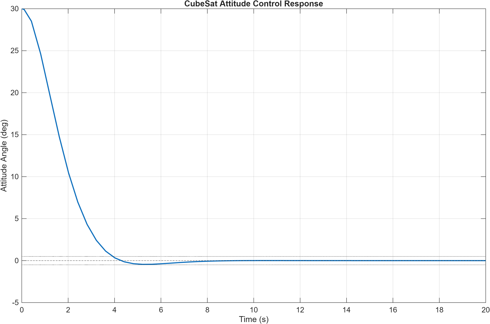
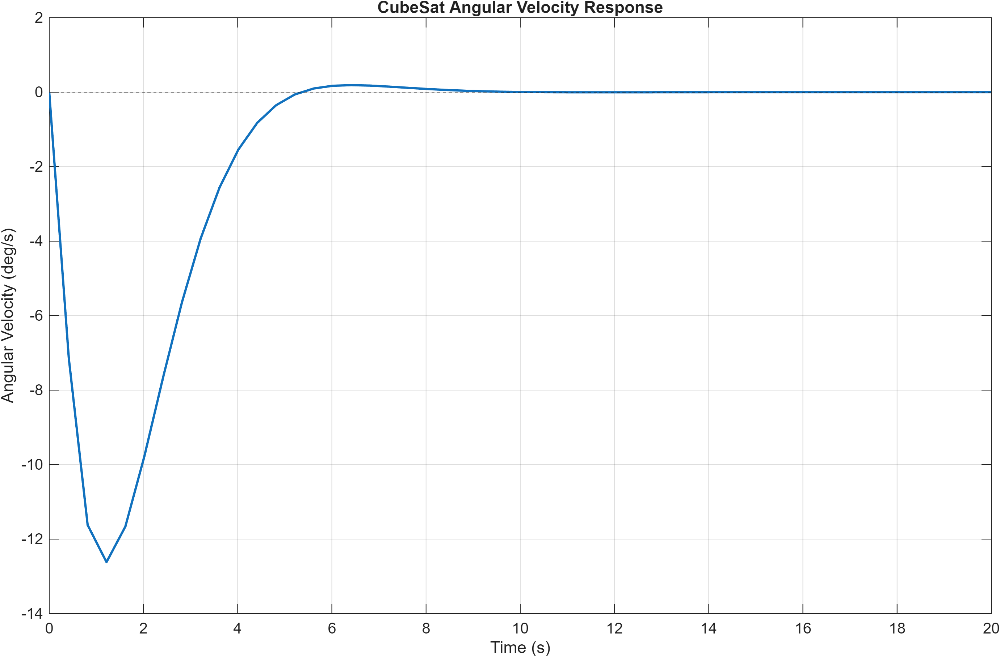
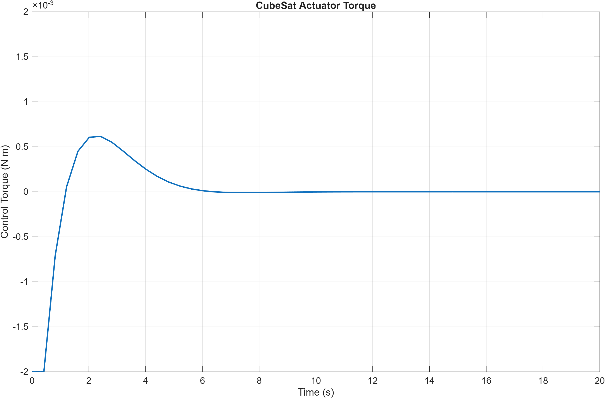
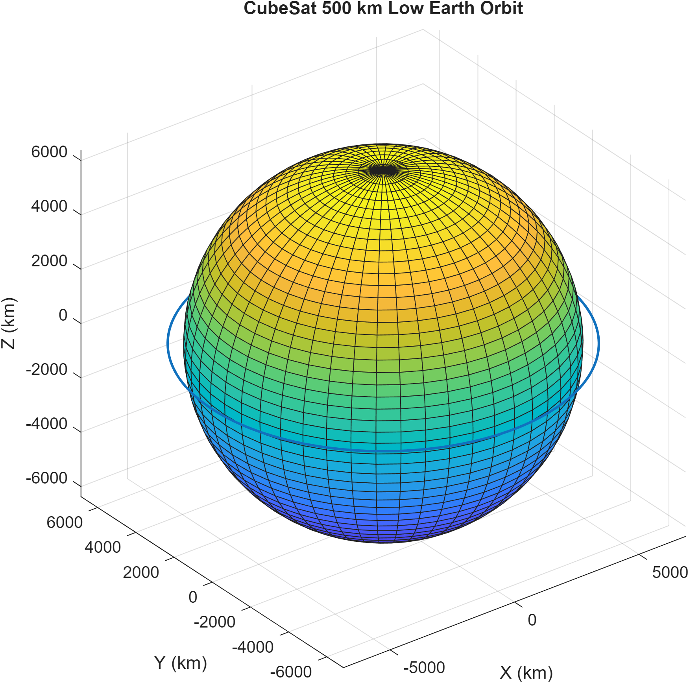

# CubeSat Attitude Control and Orbital Dynamics

## Overview
This project models a simplified CubeSat attitude-control system and a two-body Low Earth Orbit using MATLAB and Simulink.

The project has three main parts:
1. Single-axis spacecraft attitude control using a PD controller in Simulink.
2. Numerical propagation of a 500 km circular Low Earth Orbit using MATLAB.
3. C implementation and testing of the attitude-control algorithm, built with CMake and executed in Ubuntu/WSL.

## Attitude Control
The spacecraft begins 30 degrees away from its commanded attitude.

The Simulink model includes:
- Rigid-body rotational dynamics
- Closed-loop PD control
- Actuator torque saturation
- Attitude and angular-rate feedback

Baseline controller gains:
- Kp = 0.0067
- Kd = 0.0107

Actuator torque limit:
- +/- 0.002 N m

Baseline results:
- Final pointing error: 0.0000 deg
- Maximum angular velocity: 12.6173 deg/s
- Maximum control torque: 0.002000 N m
- Settling time within +/- 0.5 deg: 4.016 s
## C Controller Implementation

The PD attitude-control algorithm was also implemented in C to demonstrate software implementation of the control law outside Simulink.

The C implementation includes:
- A reusable `compute_control_torque()` function
- Proportional and derivative control terms
- ±0.002 N·m actuator saturation
- Four test cases covering different attitude and angular-rate conditions
- Compilation and execution using GCC in Ubuntu/WSL
- A CMake build configuration

The C implementation reproduced the expected controller behaviour, including actuator saturation for a 30° initial pointing error.

## Controller Tuning
Three proportional-gain values were tested while keeping Kd fixed.

| Kp | Final Error (deg) | Max Angular Velocity (deg/s) | Max Torque (N m) | Settling Time (s) |
|---|---:|---:|---:|---:|
| 0.0030 | 0.0303 | 6.5351 | 0.001571 | 12.533 |
| 0.0067 | 0.0000 | 12.6173 | 0.002000 | 4.016 |
| 0.0120 | 0.0000 | 18.3772 | 0.002000 | 4.890 |

The baseline gain Kp = 0.0067 provided the best settling-time performance of the three tested cases while maintaining stable closed-loop behaviour.

## Orbital Dynamics
A CubeSat was modelled in a 500 km circular Low Earth Orbit.

Analytical results:
- Orbital altitude: 500 km
- Circular orbital velocity: 7.617 km/s
- Orbital period: 94.47 minutes

The orbit was propagated using MATLAB ode45 and the two-body gravitational equation of motion.

Numerical validation:
- Minimum altitude: 500.000 km
- Maximum altitude: 500.000 km
- Altitude variation: 0.000 km to displayed precision

## Tools
- MATLAB
- Simulink
- C
- GCC
- CMake
- Ubuntu/WSL
- ode45 numerical integration

## Project Structure

```text
CubeSat_Project/
├── attitude_control/
├── orbital_dynamics/
├── c_implementation/
│   ├── attitude_controller.c
│   ├── attitude_controller.h
│   ├── test_controller.c
│   └── CMakeLists.txt
├── results/
└── README.md
```

## How to Run

### Attitude Control
1. Run `attitude_control/init_attitude.m`.
2. Open and run `attitude_control/cubesat_attitude.slx`.
3. Run `attitude_control/analyze_results.m` to calculate performance metrics and generate plots.

### Orbital Dynamics
Run `orbital_dynamics/orbit_simulation.m`.

This calculates the analytical circular-orbit parameters, propagates one orbit using `ode45`, validates the altitude, and generates the orbit plot.

### C Implementation

From the `c_implementation` folder:

```bash
mkdir build
cd build
cmake ..
cmake --build .
./test_controller
```

The C implementation uses a reusable PD control function with actuator saturation and four test cases covering different attitude and angular-rate conditions.

## Results

### Attitude Response


### Angular Velocity


### Actuator Torque


### 500 km Circular Orbit


